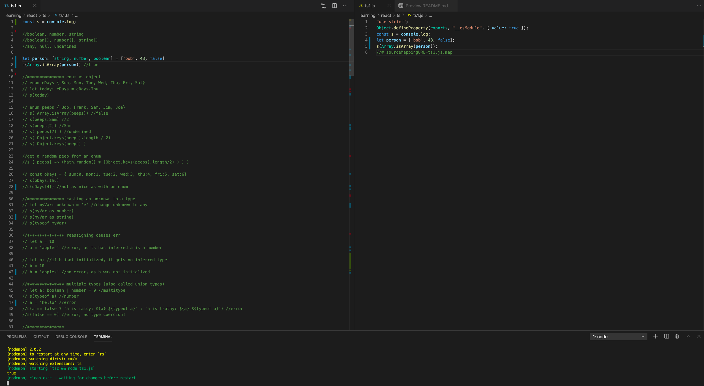

Simple examples of some basic typescript features. Uncomment out chunks to see some simple features.

Uses nodemon so you dont have to constantly save / reload / re-run. You immediately see the compiled code as well as the output.

Look in tsconfig.json to see all the typescript options.

---

How to set use:

1) Clone this repo
2) in terminal, npm i
3) in terminal, nodemon
4) view / edit ts1.js
5) save your work, the compiling and running happens automagically. goto step 4.

---

I use Visual Studio Code, heres my setup:

- The left panel = where you experiment in typescript.

- The right panel = the compiled js (output of typescript compiler).

- The bottom panel = the result of the code running.

